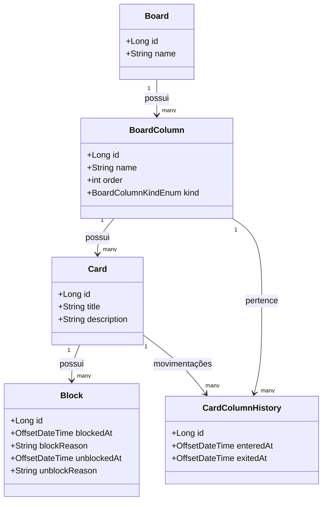

# Segundo projeto - JAVA + MYSQL - Board de Tarefas


Projeto desenvolvido para gerenciar boards de tarefas, permitindo criar colunas personalizadas e mover cards (tarefas) ao longo do fluxo de trabalho. Também contempla bloqueio/desbloqueio de cards, cancelamento e relatórios de movimentação.

---

## 🚀 Backend

- **Java 21**: Utilizamos a versão mais recente do Java para garantir desempenho, segurança e suporte a novos recursos da linguagem.
- **JDBC**: Abordagem direta de acesso ao banco via `DriverManager`, conferindo maior controle sobre as consultas e transações.
- **Liquibase**: Ferramenta de versionamento de schema que facilita o controle e a evolução do banco de dados ao longo do desenvolvimento.
- **Lombok**: Reduz boilerplate criando automaticamente construtores, getters e setters, aumentando a produtividade.
- **Java Records**: Recurso do Java moderno para criar DTOs de forma concisa, fornecendo imutabilidade e clareza de código.
- **Apache Commons CSV**: Biblioteca para exportar dados em formato CSV, simplificando a geração de relatórios.
- **OpenPDF**: Biblioteca para geração de PDFs, permitindo criar relatórios e documentos de forma programática.

## 📊 Banco de Dados

- **MySQL**: Banco de dados relacional confiável e amplamente utilizado, onde são armazenadas as informações dos boards, colunas, cards e bloqueios.

## ✅ Mapeamento e Migrations

- **Liquibase**: Controla e versiona as mudanças no banco de dados, garantindo consistência do schema em diferentes ambientes e facilitando rollback em caso de problemas.

---

# Diagrama de Classe do Modelo ER do Banco


---

## 1. Descrição Geral

Este projeto cria e manipula um **board de tarefas**, onde cada board contém colunas que representam fases do fluxo de trabalho (exemplo: **Inicial**, **Em andamento**, **Concluído**, **Cancelado** etc.). Os **cards** são as tarefas em si e podem ser movidos entre as colunas seguindo regras definidas. Também é possível **bloquear** um card por algum motivo e depois desbloqueá-lo, armazenando informações de data, hora e motivo.

### **Objetivos Principais**

- Criar boards customizados, com colunas de diferentes tipos (inicial, pendente, final e cancelada).  
- Criar e mover cards ao longo dessas colunas.  
- Bloquear e desbloquear cards, registrando motivos.  
- Cancelar cards (movendo-os diretamente para a coluna de cancelamento).  
- Salvar tudo em um banco MySQL, usando Liquibase para controle de versões do schema.  

### **Estrutura**

- **UI** em modo console (CLI) que exibe menus para criar/excluir boards, selecionar um board, mover cards etc.  
- **Camada de serviço** com regras de negócio (validações para mover, bloquear, cancelar).  
- **DAO** (Data Access Objects) para acesso ao banco de dados via JDBC.  
- **Liquibase** para migrations (criação de tabelas e evolução do schema).  
- **Relatórios** que exibem e exportam dados sobre tempo de permanência em cada coluna e bloqueios.

---

## 2. Principais Funcionalidades

- **Criar Board**  
  Permite dar um nome ao board e definir as colunas necessárias (tipo inicial, pendentes, final e cancel).  
- **Selecionar Board**  
  Abre um menu de manipulação de cards nesse board.  
- **Excluir Board**  
  Remove o board do banco.  
- **Criar Card**  
  Cria um card no board selecionado, na coluna inicial.  
- **Mover Card**  
  Move o card para a próxima coluna (de acordo com a ordem definida).  
- **Bloquear Card**  
  Marca o card como bloqueado, com o motivo e registra data/hora.  
- **Desbloquear Card**  
  Remove o bloqueio, indicando também o motivo do desbloqueio.  
- **Cancelar Card**  
  Move o card diretamente para a coluna de cancelamento (se estiver em qualquer coluna que não seja final).  
- **Ver Board**  
  Lista as colunas do board e quantos cards cada uma possui.  
- **Ver Coluna**  
  Lista todos os cards de uma coluna específica.  
- **Ver Card**  
  Exibe detalhes do card selecionado (descrição, bloqueio, quantas vezes foi bloqueado etc.).  

---

## 3. Funcionalidades Extras (Relatórios)

Além do fluxo principal, há funcionalidades adicionais para **auditoria e acompanhamento**:

- **Histórico de Movimentação**  
  Para cada card, registramos quando ele entrou em uma coluna (`entered_at`) e quando saiu (`exited_at`).  
  Permite calcular quanto tempo cada card ficou em cada coluna, até ser finalizado ou cancelado.  

- **Relatório de Tempo**  
  Mostra o tempo que cada card passou em cada coluna.  
  Pode-se gerar **relatório geral** do board ou filtrar por card.  

- **Relatório de Bloqueios**  
  Lista todos os bloqueios de cada card, com data/hora de bloqueio, desbloqueio, motivos e duração total do bloqueio.  

- **Exportação em CSV e PDF**  
  Esses relatórios podem ser salvos em arquivos CSV (usando **Apache Commons CSV**) ou PDF (usando **OpenPDF**).  
  O usuário, através do menu de console, pode escolher gerar estes arquivos e salvá-los em um diretório local.

---

## 4. Como Executar

1. **Clonar o repositório**:
   ```bash
   git clone https://github.com/usuario/board-de-tarefas.git
   cd board-de-tarefas

2. **Configurar o MySQL**

- Crie um banco no MySQL (ex: `mydatabase`).  
- Ajuste o `ConnectionConfig` (ou arquivo de propriedades) com suas credenciais (`url`, `user`, `password`).  

3. **Executar Migrations**

- Rode: `gradlew run` (ou `mvn spring-boot:run`, dependendo de como você configurou) e verifique se as migrations Liquibase são aplicadas.  
- O Liquibase deve criar as tabelas (`BOARDS`, `BOARDS_COLUMNS`, `CARDS`, `BLOCKS`, `CARD_COLUMN_HISTORY`) se não existirem.  

4. **Rodar o Projeto**

- Basta executar `gradlew run` ou a classe `Application` no IntelliJ/Eclipse.

5. **Interagir via Console**

- O menu inicial perguntará se deseja criar board, selecionar board, excluir board, etc.

---

## 5. Próximos Passos / Melhorias

- **Interface Web** (ex: Spring MVC/Thymeleaf ou Angular/React) para substituir o menu console.  
- **Sistema de Usuários/Permissões** para restringir quem pode criar ou excluir boards.  
- **Logs e Observabilidade** (ex: SLF4J/Logback, Grafana).  
- **Testes** usando **JUnit**, **TestContainers** para testes de integração com MySQL.


